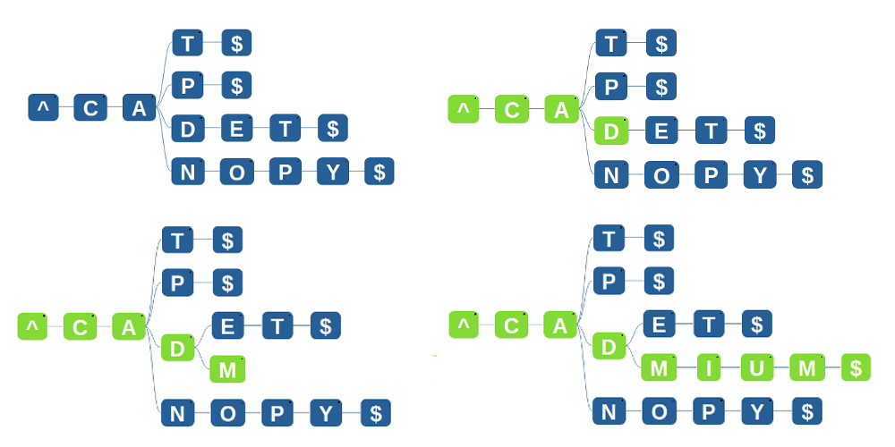

### Insertion Algorithm

We have understood what a trie is and how we can use one to search for words. Now let's take a look into how we can contruct a trie out of a collection of words by inserting each word into the trie one by one:

   - Convert any given string **[WORD]** into **[^WORD$]**, where the ^ character denotes start of the word and $ denotes the end of the word. This is important as we have seen in the tries explanation, where one word is the prefix of another, eg. ANT and ANTLER, and we need to find whether ANT is present in the Trie or not.
   - We search for the letters one by one, and keep matching till they (the current prefix) are present in the trie. We stop as soon as we see the first letter that cannot be matched in the trie.
   - Now we branch out from the letter till where we matched, and add the new letter that could not be matched.
   - Now we keep adding all the remaining letters as children of the current letter which we are on, until the whole word is done and we then add a "$' to it.

### Step by Step process

