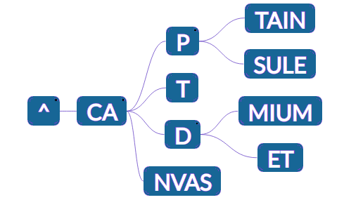

### Can we store more Data in each node?

Again in our Trie, we see that there are multiple nodes each storing one letter, and only having one child. This is a waste of memory, since we can lower the number of nodes by a lot, if every single unbranched path could be compressed in a single node as below.. This idea would be extremely useful when we are working with text containing many words, and we need to look for patterns (In this way, we will be able to store only the start and end positions of these words making our nodes smaller - Don't worry if you don't understand - The idea will bear an elaborated explanation in Suffix Tries.)

### A Compressed Trie

### Bounds on Complexity

Now we can prove stronger upper bounds on the memory complexity of the Trie.

   - All internal nodes of such a trie **are branching** (has atleast 2 children)
   - Each new unique word **adds only one Leaf Node** (a '$' sign at the end)
   - If there are N words, then the number of leaves is O(N) and number of internal nodes is also O(N), using the properties of a Tree. Therefore, total number of nodes is O(N).

This is a very crucial observation, and helps incredibly in many search operations. 
