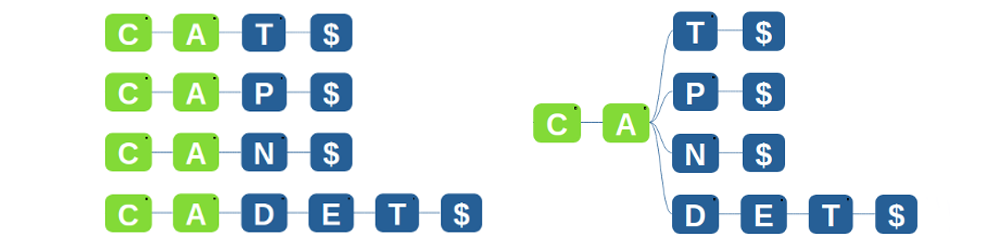

### Search a word from a list - Naive Approach

Let's say we have a huge list of words, for example a Dictionary (Here in this example our list is [CAT, CAP, CAN, CADET]). You want to find out whether or not a word, let's say CABLE, is in this list. The naive approach to solving this problem is as follows.

  -  Store all the words in the list into separate arrays / linked lists / any data structure, as done in the figure on the left below.
  -  When the new word comes, go through each word in the list and try to match it. Report a match if there is one, else a failure.

We notice here that it is takes a lot of steps to search a word, and that we waste a lot of memory. Notice all the words that start with a 'C' followed by an 'A', for which we sort those letters over and over again for each word. Let's try to improve our approach.

### Why Tries should be used

### So what is a TRIE?

The way we, as humans, approach looking at words in a dictionary, is that we try to find the first letter 'C', then in the pages starting with 'C', we try and find 'A', then 'B', then 'L', and 'E'. We want to take the same approach in our algorithm. We can optimize our search in the following way:

  -  We can merge all the common letters, that is if two words have a common prefix, then the prefix would be stored once and the words will branch out of it. (saves memory).
  -  We can now search in one go. We see that all words start with a 'C', followed by an 'A', hence we can try finding 'B', and report failure upon it not being there. This is the approach taken by a common man to solve this problem.

You can see the illustration of this tree like method (A TRIE), in the image on the right. **A trie is nothing but a Tree of letters, where each path from the root to the leaves represents a word that is made up of all the letters that were found on it's path.** It helps us solve the problem of searching words in a list quickly. 
