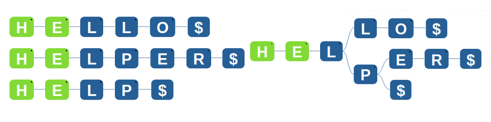

<iframe src="https://www.youtube.com/embed/oeSjdu8Y7bM" frameborder="0" allow="autoplay; encrypted-media" allowfullscreen></iframe>

### Algorithm

  -  We start at the Root Node.
  -  We move to each of it's children and match the first letter of our word with them.
  - If none of the children match, then we report that the word is not in the list.
  -  If one of the children match, then we take that as our new node, and compare it's children with the second letter.
  -  We keep doing this until we are out of letters in the word we are searching for, and finally when the last letter is matched, we try to match an end-point '$'. If it's there, then the word exists, otherwise it does not.

This is the algorithm for searching. Let's now try to understand why we need endpoints.

### Why $ is needed

### Why $ is needed

We have added a '^' to the start of each word and a '$' to the end. This is to solve the problem which is shown in the image above. Say there are two words HELL and HELLO in our list. One word (Hell) is the prefix of another (Hello). Now if we try to seach for HELL, we will match each letter, but we will never be able to tell if HELL was in the Trie, or it was there only because HELLO was there. We solve this by adding a $ to the end of each word, so that we can then check if there was a word HELL that ended there by also matching an end character '$'. We add the start char '^' so that all words can have a common root, thus making this a convienient tree to code up, with one root.

   
