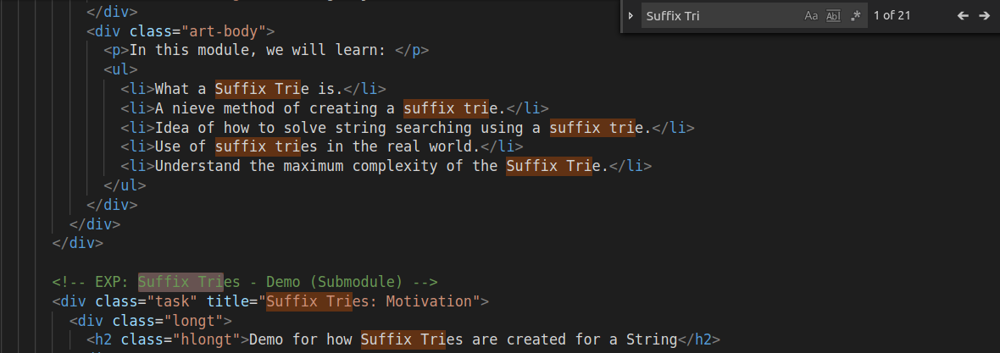

### Finding Patterns in a String

Now that we know how to search for a string in a list of strings, let's turn to finding a pattern (a string or a regular expression) in a huge bulk of text. This is what you do when you press CTRL+F to search in Microsoft Word. Lets try to see how we would achieve this:

   - We already know how to find a word in a huge list.
   - If we do not match till '$', we can also find any prefix in a list of words.
   - If our list is the set of all suffixes of a string, then we can match any prefix of suffix.
   - Any prefix of suffix is a substring, so we want to take the list of all suffixes of our text and match any prefix of it.
   - We can use a compressed trie to store this in O(n) space, since there are O(n) unique suffixes in a text of length n.

### Search in a Text editor can be implemented this way.

